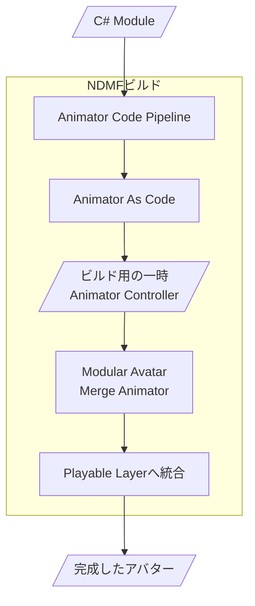
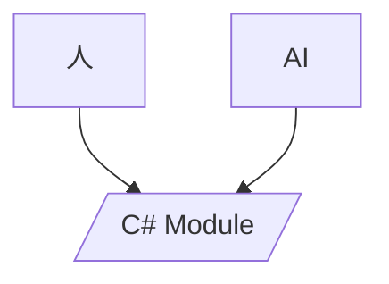

# Animator Code Pipeline ガイド

Animator Code Pipelineは、VRChatアバターのAnimatorを**C#コードから作り、NDMFビルド時に非破壊で組み込む**ためのパッケージです。

Animator Controllerを直接編集して大量のStateやTransitionを管理する代わりに、必要な動作をC#のModuleとして記述します。

ModuleはGitで管理でき、人が直接編集することも、AIに作成や修正を任せることもできます。

---

## 1. 何ができるの？

Animator Code Pipelineでは、衣装やアクセサリーの切り替え、表情、ジェスチャー、Blend Tree、Parameter、Modular Avatarとの連携などをC#のModuleとして管理できます。

**Animation ClipやParameter、Animator Controllerの構成をコードから生成できるため、それぞれを個別に作成・管理する手間を減らせます。**

作成したModuleは、NDMFビルド時にAnimator As CodeによってAnimatorへ変換され、Modular Avatarを通してアバターへ統合されます。

---

## 2. どんな仕組み？

大まかな流れは次の通りです。

- `AnimatorCodeModuleSet` selects the project modules explicitly. Modules are instantiated once per enabled Settings component and ordered by `Order`, then `Id`, then full type name.
- Each Settings component gets one temporary cloned working controller. AAC persistence is requested before module generation; generated assets are build outputs, not project source.
- `Layer("Suffix")` shares a layer only when the exact suffix is reused within that Settings component. Because AAC normalizes `.` to `_`, distinct suffixes such as `Face.Blink` and `Face_Blink` are rejected as a configuration error.
- 生成処理はビルド中の一時Animator Controllerに対して行われます。
- 元のAnimator Controllerへ生成結果を直接書き込まないため、NDMFとModular Avatarの非破壊ワークフローの中で利用できます。

---

## 3. 最低限のセットアップ

- 基本的には、アバター内にAnimator Code Pipeline用のGameObjectを用意します。

```text
Avatar
└── AnimatorCodePipeline
    ├── Animator Code Pipeline Settings
    ├── Source Controller (regular AnimatorController asset)
    ├── Modular Avatar Merge Animator
    ├── Modular Avatar Parameters (when registering generated parameters)
    ├── Modular Avatar Menu Item (Optional)
    └── Modular Avatar Menu Installer (Optional)
```

### AnimatorCodePipelineSettings
- **Animator Code Pipelineのメインコンポーネントです。**
- どのModuleを使うかを指定するためのコンポーネントです。
- `AnimatorCodeModuleSet`を設定すると、その中に登録されたModuleがビルド時に使用されます。
- `Source Controller`には、プロジェクト内の通常の`AnimatorController`を設定します。
- 同じGameObjectの`ModularAvatarMergeAnimator`にも、同じControllerを設定してください。
- ACPはSource Controllerをビルド時に複製して使用します。元のControllerとアバター本体のFX Controllerは変更しません。
- ACP専用のローカル`Animator`コンポーネントは必須ではありません。アバター本体のAnimatorをSource Controllerの代わりに使用しないでください。

### Modular Avatar Merge Animator
- **Modular Avatarに付属するコンポーネントです。**
- 生成されたAnimator Controllerを、FXやGestureなどのVRChat Playable Layerへ非破壊で統合するために使用します。
- どのPlayable Layerへ統合するかは、Modular Avatar Merge Animator側で設定します。
- ACPの通常構成では、同じGameObjectにあるSource Controllerを参照し、生成後のControllerはNDMFビルドクローン側だけに割り当てられます。

### Modular Avatar Parameters
- Moduleが生成・使用するVRChatパラメーターをアバターへ登録する場合に使用します。
- Menu Itemだけで自動作成に頼らず、同期種別、初期値、保存設定を明示したい場合はこのコンポーネントに登録します。

---

## 4. Moduleを書く

- Animatorの動作は、C#の`AnimatorCodeModule`として記述します。
- Animator Controller上でStateやTransitionを手作業で組み立てる代わりに、動作の内容を通常のC#コードとして管理できます。
- パッケージには、最初のModuleを作るためのテンプレートと、用途別のサンプルが含まれています。

---

## 5. 人が使っても、AIが使っても同じ

- Animator Code PipelineはAIによる作成や修正をしやすくすることを意識していますが、人が直接コードを書く場合も同じ仕組みを使います。
- 人が作る場合もAIが作る場合も、基本的には同じC# Moduleを編集します。

- Animator Controllerの内部構造を直接編集するのではなく、通常のC#コードとして機能を扱えるため、Gitで差分を確認したり、修正を戻したり、複数のModuleへ分けて管理したりしやすくなります。

---

## 6. 次に読むもの

- ここから先は、使い方によって分かれます。

### AIを使ってAnimatorを作りたい人

- [AI / UnityMCP ワークフロー](ai-workflow.md)
- AIやUnityMCPを使って、アバターを確認しながらModuleを作成・修正する流れを初心者向けに説明します。

### 自分でModuleを実装したい人

- [Module API Reference](module-api.md)
- `AnimatorCodeModule`、`AnimatorCodeBuildContext`、ModuleSet、Layer共有、非破壊ビルドなど、Animator Code Pipelineの技術仕様を説明します。
