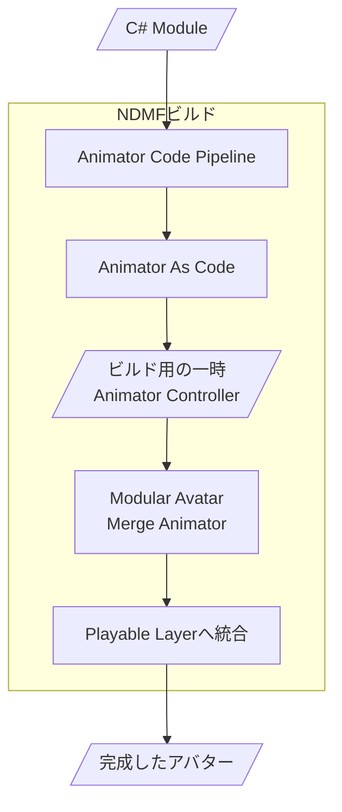
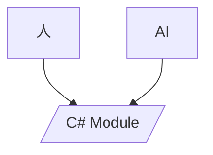

# Animator Code Pipeline ガイド

Animator Code Pipelineは、VRChatアバターのAnimatorを**C#コードから作り、NDMFビルド時に非破壊で組み込む**ためのパッケージです。

ModuleはGitで管理でき、人が直接編集することも、AIに作成や修正を任せることもできます。

---

## 1. 何ができるの？
* 衣装・アクセサリー切替、表情、ジェスチャー、Blend Tree、ParameterなどをC# Moduleで管理
* Animation ClipやAnimator Controller構成をコードから生成
* NDMFビルド時にAnimator As Codeで生成し、Modular Avatar経由でアバターへ統合

---

## 2. どんな仕組み？

大まかな流れは次の通りです。


---

## 3. 最低限のセットアップ

- 基本的には、アバター内にAnimator Code Pipeline用のGameObjectを用意します。

```text
Avatar
└── AnimatorCodePipeline
    ├── Animator Code Pipeline
    ├── Modular Avatar Merge Animator
    ├── Modular Avatar Parameters (パラメーター登録が必要な時だけ)
    ├── Modular Avatar Menu Item (メニューが必要な時だけ)
    └── Modular Avatar Menu Installer (メニューが必要な時だけ)
```

### AnimatorCodePipelineSettings
- **Animator Code Pipelineのメインコンポーネントです。** 同じGameObjectに`ModularAvatarMergeAnimator`を必要とします。
- どのModuleを使うかを指定するためのコンポーネントです。
- `AnimatorCodeModuleSet`を設定すると、その中に登録されたSerializeReference Module定義がビルド時に使用されます。各Settingsのビルドでは定義から独立したModuleインスタンスが作成されます。

### Modular Avatar Merge Animator
- **Modular Avatarに付属するコンポーネントです。**
- 生成されたAnimator Controllerを、FXやGestureなどのVRChat Playable Layerへ非破壊で統合するために使用します。
- どのPlayable Layerへ統合するかは、Modular Avatar Merge Animator側で設定します。
- ACPはMerge AnimatorのAnimatorをSource of Truthとして読み取り、ビルド中にcloneします。生成後のControllerはNDMFビルドクローン側だけに割り当てられます。
- ACP専用のローカル`Animator`コンポーネントは必要ありません。
- Controller、Playable Layer、Path Mode、Relative Path Root、Layer PriorityはMerge Animator側で設定します。

### Modular Avatar Parameters
- **Modular Avatarに付属するコンポーネントです。**
- Moduleが生成・使用するVRChatパラメーターをアバターへ登録する場合に使用します。
- Menu Itemだけで自動作成に頼らず、同期種別、初期値、保存設定を明示したい場合はこのコンポーネントに登録します。

---

## 4. Moduleを書く

- Animatorの動作は、C#の`AnimatorCodeModule`として記述します。
- Animator Controller上でStateやTransitionを手作業で組み立てる代わりに、動作の内容を通常のC#コードとして管理できます。
- パッケージには、最初のModuleを作るためのテンプレートと、用途別のサンプルが含まれています。

---

## 5. 人が使っても、AIが使っても同じ

- Animator Code PipelineはAIによる作成や修正をしやすくすることを意識していますが、人が直接コードを書く場合も同じ仕組みを使います。
- 人が作る場合もAIが作る場合も、基本的には同じC# Moduleを編集します。

- Animator Controllerの内部構造を直接編集するのではなく、通常のC#コードとして機能を扱えるため、Gitで差分を確認したり、修正を戻したり、複数のModuleへ分けて管理したりしやすくなります。

---

## 6. 次に読むもの

- ここから先は、使い方によって分かれます。

### AIを使ってAnimatorを作りたい人

- [AI / UnityMCP ワークフロー](ai-workflow.md)
- AIやUnityMCPを使って、アバターを確認しながらModuleを作成・修正する流れを初心者向けに説明します。

### 自分でModuleを実装したい人

- [Module API Reference](module-api.md)
- `AnimatorCodeModule`、`AnimatorCodeBuildContext`、ModuleSet、Layer共有、非破壊ビルドなど、Animator Code Pipelineの技術仕様を説明します。
